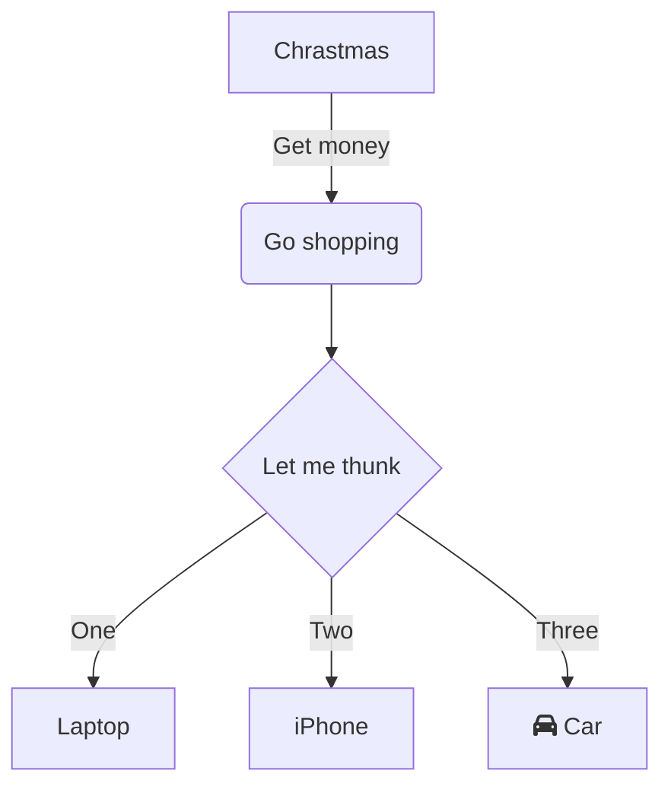

---
---

# Simple Markdown Content

This is some extremly simple content 
with errorees for Vale to discover.

These demonstrations use a variety of style guides.
For example Microsoft, Google and Write-Good.

